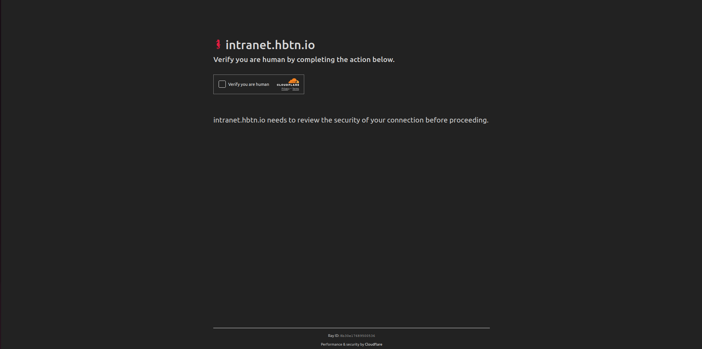
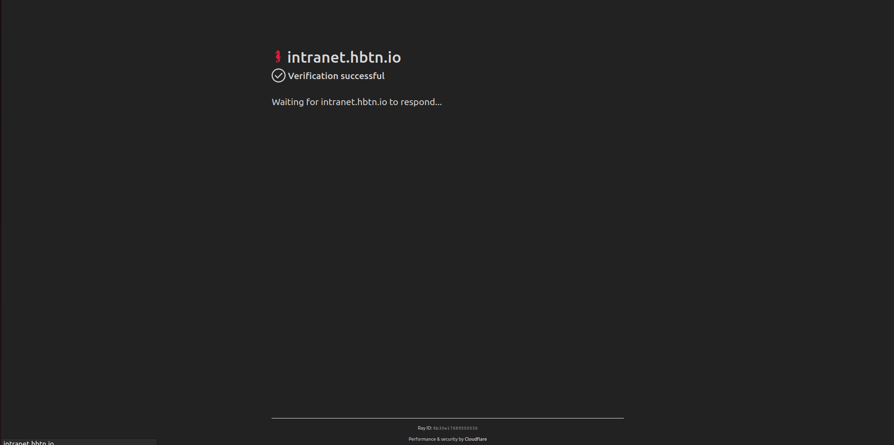

# HI-Bot (Holberton School Intranet Bot)

HI-Bot is an automation tool designed for Holberton School students. It retrieves the required repository, directory, and file names for your current project from the Holberton School Intranet and automatically creates the necessary directory structure in your local environment.


## Install

Clone HI-Bot

```bash
  git clone https://github.com/KamoheloKoali/HI-Bot.git
```

Go to the project directory

```bash
  cd HI-Bot
```

Create a virtual environment (optional but recommended)

```bash
  python3 -m venv venv
  source venv/bin/activate  # On Windows use `venv\Scripts\activate`
```

Install dependencies

```bash
  pip install -r requirements.txt
```


## Usage/Examples

<b><i>HI-Bot only works using Google Chrome</i></b>, so please install it if you do not already have it installed.

In order for HI-Bot to create the directory and files in the repository defined on the Holberton School intranet correctly, the repository must be cloned locally and must be relative to the HI-Bot repository.

Example: 


Create a .env.local file inside HI-Bot's repository to store your student email and password, which are required for logging into the Holberton School Intranet.

``` bash
  STUDENT_EMAIL="your_email@example.com"
  STUDENT_PASSWORD="your_password"
```

You can run HI-Bot with the following command. The Chrome installation path is optional unless Chrome is installed in a non-default location.

``` bash
  python3 main.py <curriculum part> [path to Chrome installation (optional)]
```
Example:

``` bash
  python3 main.py part 3
```

``` bash
  python3 main.py part 3 "/Applications/Google Chrome.app/Contents/MacOS/Google Chrome"
```

Once you run it, it should open up a Google Chrome window. For HI-Bot to get past the Cloudflare CAPTCHA, it needs your help. All you need to do is take the Cloudflare CAPTCHA test.




<i>
<b>After that, you can leave everything to HI-Bot!</b> Don't forget to leave a star
</i>🙂

## Support

For support, feel free to reach out via email at kamohelokoali201@gmail.com or through any of the social media platforms listed on my GitHub profile.

Happy coding! 🚀

