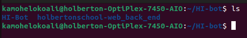

# HI-Bot (Holberton School Intranet Bot)

HI-Bot is a bot meant to be used by Holberton School students. It goes onto the Holberton School Intranet with the aim of retrieving the name of the repository, directory and files needed for the current project and creates the directory and files found on the intranet under the specified repository.


## Install

Clone HI-Bot

```bash
  git clone https://github.com/KamoheloKoali/HI-Bot.git
```

Go to the project directory

```bash
  cd HI-Bot
```

Install dependencies

```bash
  pip install -r requirements.txt
```


## Usage/Examples

HI-Bot only works using Google Chrome, so please install if you do not already have it installed.

In order for HI-Bot to create the directory and files in the repository defined on the Holberton School intranet correctly, the repository must be cloned locally and must be relative to the HI-Bot repository.

Example: 

in the repository, create a .env.local file and paste your student email and password

``` bash
  STUDENT_PASSWORD="..."
  STUDENT_EMAIL="..."
```

you can then run HI-Bot using

``` bash
  python3 main.py
```

OR

``` bash
  python main.py
```
## Support

For support, email kamohelokoali201@gmail.com or contact me using any of the social media profiles listed on my github profile.

